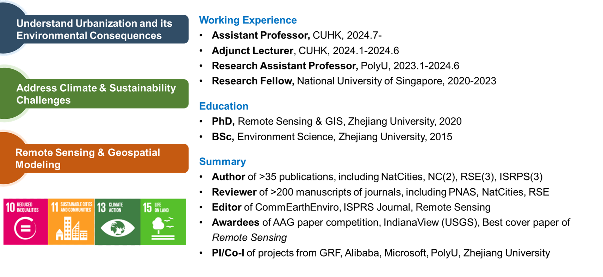

---
permalink: /
title: " "
excerpt: "About me"
author_profile: true
redirect_from: 
  - /about/
  - /about.html
---  

🎨Vincent Van Gogh: I often think that the night is even more alive and richly colored than the day   
🗺️Qiming: So do I 

## 🚨Opportunities👩🏻‍🎓👨🏼‍🎓 ##
I am looking for 1-2 PhD Students (2026 Fall), ~~1 Postdoc (2024 Fall)~~ and Visiting scholars to join my team at CUHK and work on one of the following topics: Nighttime Light Remote Sensing, Urban Sustainability, Global Environmental Changes, and Nature-based Climate Solutions. [**More Details**](https://qmzheng09work.github.io/opportunities/).  
## 🌏Welcome to my homepage ##  

My research interests center on the human-environment-climate nexus. I aim to leverage remote sensing based geospatial intelligence, environment and climate models, and other advanced interdisciplinary approaches to better understand the impacts of human activities on environmental and climate changes, and to deliver policy-relevant solutions to cutting-edge challenges in climate change mitigation and sustainable development. My current research focuses on the following themes:
* Remote sensing of urban environment;
* Opportunities and uncertainties in nature-based climate solutions;
*	Global environmental and climate changes;
*	Nighttime light remote sensing;

## 📰News ##  
*   07/07/2025: I joined the journal *Geographical Science地理科学* as the Vice Director (领导小组副主任) of Young Editorial Board Member  
*   14/05/2025: My proposal "Spatially Explicit Modeling of Reforestation Co-benefits with Geospatial AI Approaches" was funded as one of ten 2025 Strategic Partnership Award projects of CUHK to support research collaboration with Prof. Yiwen Zeng (NTU, SG) and Dr. Sreekar Rachakonda (UQ, AUS).  
*   05/05/2025: I was named as one of the Top 20 Reviewers for ***Remote Sensing of Environment*** for the calendar year 2024.  
*   12/02/2025: My paper "Nighttime lights reveal substantial spatial heterogeneity and inequality in post-hurricane recovery" has been published in ***Remote Sensing of Environment***! [[Download(OA)](https://doi.org/10.1016/j.rse.2025.114645)]  
*   09/01/2025: My co-authored paper on "Consistency assessment of cross-sensor calibrated nighttime light image products" has been published in ***Remote Sensing of Environment***! [[Download](https://www.sciencedirect.com/science/article/pii/S0034425725000021?via%3Dihub)]  
*   10/12/2024: My PhD student Te MU has got his first research on "Robust disaster impact assessment with daily nighttime light images" published in ***IEEE TGRS*** ].
*   28/10/2024: My book review paper "Seeing the unseen in cities at night" has been published in ***Nature Cities*** ]   
*   01/10/2024: I started my new service duty as an external editor of [*Communications Earth and Environment*](https://www.nature.com/commsenv/editorial-board#QimingZheng)  
*   02/07/2024: I received a HK$730K General Research Fund from Research Grants Council Hong Kong (role: PI).
*   02/07/2024: I officially joined the Dept. of Geography and Resource Management at Chinese University of Hong Kong as a full-time Assistant Professor (tenure-track).
*   24/05/2024: My co-authored paper on "Downscalling VIIRS Nighttime light image" has been published in *International Journal of Applied Earth Observation and Geoinformation*! [[Download(OA)](https://doi.org/10.1016/j.jag.2024.103924)]  
*  20/04/2024: My publications exceeded 1,000 Google Scholar citations!
*  18/03/2024: Our review paper "Nighttime light remote sensing for urban applications: progress, challenges, and prospects" is **ESI highly cited**! [[Download (OA)](https://www.sciencedirect.com/science/article/pii/S0924271623001521)].
*  27/01/2024: Our work "Geo-STO3Net: A deep neural network integrating geographical spatiotemporal information for surface ozone estimation" was accepted by *IEEE TGRS* ! [[Download](https://ieeexplore.ieee.org/document/10414127)].
*  20/12/2023: The work that I supervised,"Estimating building heights in complex urban areas", has been published in ***International Journal of Applied Earth Observation and Geoinformation***]
* 13/12/2023: My co-authored paper on "Uncertainties in deforestation emission baseline methodologies" has been published in ***Nature Communications***! [[Download (OA)](https://doi.org/10.1038/s41467-023-44127-9)]
* 29/09/2023: We posted an eLetter commentary on light pollution measurements in *Science*. [[View eLetter](https://www.science.org/doi/10.1126/science.adg0473#elettersSection)].
* 21/09/2023: Our manuscript about global abandoned cropland was published in ***Nature Communications***.[[Download (OA)](https://www.nature.com/articles/s41467-023-41837-y)].[Media:[Eurekalert AAAS](https://www.eurekalert.org/news-releases/1003363);[Earth.com](https://www.earth.com/news/abandoned-croplands-could-boost-food-security-and-climate-mitigation/); see [More](https://www.nature.com/articles/s41467-023-41837-y/metrics)].

## ✉️Contact Info. ##
Qiming Zheng, Ph.D.   
Department of Geography and Resource Management  
The Chinese University of Hong Kong  
2nd Floor, Wong Foo Yuan Building  
Shatin, N.T., Hong Kong SAR, China  

Email: <u>qmzheng@cuhk.edu.hk</u>  
Department Page: [[Link](https://www.grm.cuhk.edu.hk/en/profile/prof-zheng-qiming/)]

Updated 31/03/2025
