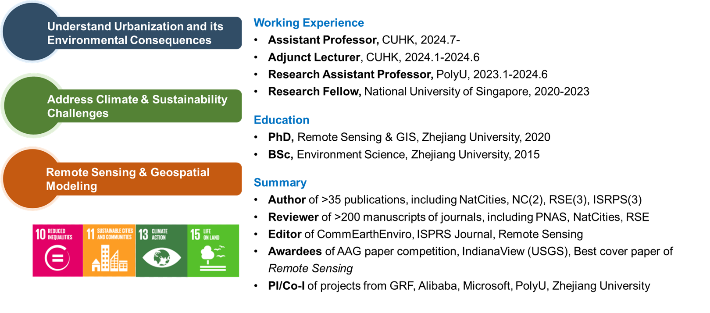

---
permalink: /
title: " "
excerpt: "About me"
author_profile: true
redirect_from: 
  - /about/
  - /about.html
---  

🎨Vincent Van Gogh: I often think that the night is even more alive and richly colored than the day   
🗺️Qiming: So do I 

## 🚨Opportunities👩🏻‍🎓👨🏼‍🎓 ##
I am looking for ~~**1 PhD Student(2024 Spring)**~~, **1-2 PhD Students (2025 Fall)**, **1 Postdoc (2024 Fall)** [**[Apply Here]**](https://cuhk.taleo.net/careersection/cu_career_non_teach/jobdetail.ftl?job=240001HS) and **Visiting students/scholars (2024 Fall)** to join my team at CUHK and work on one of the following topics: Nighttime Light Remote Sensing, Urban Sustainability, Global Environmental Changes, and Nature-based Climate Solutions. [**More Details**](https://qmzheng09work.github.io/opportunities/).  
## 🌏Welcome to my homepage ##  

My research interests center on the human-environment-climate nexus. I aim to leverage remote sensing based geospatial intelligence, environment and climate models, and other advanced interdisciplinary approaches to better understand the impacts of human activities on environmental and climate changes, and to deliver policy-relevant solutions to cutting-edge challenges in climate change mitigation and sustainable development. My current research focuses on the following themes:
* Remote sensing of urban environment
* Global environmental and climate change
* Land-based climate change mitigation
* Remote sensing image processing techniques and applications
* Nighttime light remote sensing

## 📰News ##  
*  24/05/2024: My co-authored paper on "Downscalling VIIRS Nighttime light image" has been published in *International Journal of Applied Earth Observation and Geoinformation*! [[Download(OA)](https://doi.org/10.1016/j.jag.2024.103924)]  
*  20/04/2024: My publications exceeded 1,000 Google Scholar citations!
*  04/04/2024: **I will officially join the Dept. of Geography and Resource Management at Chinese University of Hong Kong as a full-time Assistant Professor (tenure-track) in the coming July**.
*  18/03/2024: Our review paper "Nighttime light remote sensing for urban applications: progress, challenges, and prospects" is **ESI highly cited**! [[Download (OA)](https://www.sciencedirect.com/science/article/pii/S0924271623001521)].
*  27/01/2024: Our work "Geo-STO3Net: A deep neural network integrating geographical spatiotemporal information for surface ozone estimation" was accepted by *IEEE TGRS* ! [[Download](https://ieeexplore.ieee.org/document/10414127)].
*  08/01/2024: I joined the Dept. of Geography and Resource Management at Chinese University of Hong Kong as a Part-time Lecturer.
*  20/12/2023: The work that I supervised,"Estimating building heights in complex urban areas", has been published in *International Journal of Applied Earth Observation and Geoinformation*]
* 13/12/2023: My co-authored paper on "Uncertainties in deforestation emission baseline methodologies" has been published in *Nature Communications*! [[Download (OA)](https://doi.org/10.1038/s41467-023-44127-9)]
* 29/09/2023: We posted an eLetter commentary on light pollution measurements in *Science*. [[View eLetter](https://www.science.org/doi/10.1126/science.adg0473#elettersSection)].
* 21/09/2023: Our manuscript about global abandoned cropland was published in *Nature Communications*.[[Download (OA)](https://www.nature.com/articles/s41467-023-41837-y)].[Media:[Eurekalert AAAS](https://www.eurekalert.org/news-releases/1003363);[Earth.com](https://www.earth.com/news/abandoned-croplands-could-boost-food-security-and-climate-mitigation/); see [More](https://www.nature.com/articles/s41467-023-41837-y/metrics)].
* 08/08/2023: Our proposed research on building height estimation was selected for Alibaba DAMO Academy AI Earth Joint Research & Innovation Programme.
* 17/06/2023: I gave a talk on “Impact of temporal compositing on nighttime light data and its applications" at Quantitative RS Forum 2023, Chengdu, China. [[Photo@Twitter](https://twitter.com/QimingZheng2/status/1670058400305086464)].
* 29/05/2023: Our review paper "Nighttime light remote sensing for urban applications: progress, challenges, and prospects" was published in *ISPRS P&RS Journal* [[Download (OA)](https://www.sciencedirect.com/science/article/pii/S0924271623001521)].

## ✉️Contact Info. ##
Qiming Zheng, Ph.D.   
Department of Geography and Resource Management  
The Chinese University of Hong Kong  
2nd Floor, Wong Foo Yuan Building  
Shatin, N.T., Hong Kong SAR, China  

Email: <u>Qiming.Zheng@outlook.com</u>

Updated 24/05/2024
