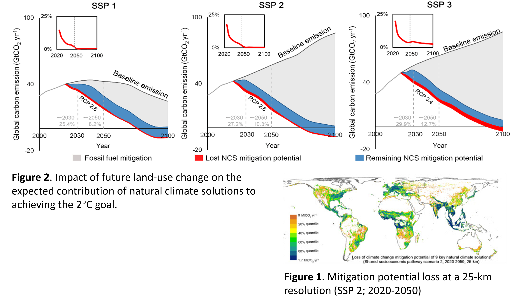

## Understanding the Urban-Climate-Environment nexus with geospatial data, model, and ML/AI techniques. 

see full publication list in [Publication](https://qmzheng09work.github.io/publications/) or [Google Scholar](https://scholar.google.com/citations?user=azf48tgAAAAJ&hl=EN)

### Topic 1: Understanding Global Urbanization for Sustainable Development

**1. Characterizing urban land changes of 30 global megacities using nighttime light time series stacks**    
  We proposed a methodology framework to characterize diverse urban land changes of 30 global megacities using monthly nighttime light time series from VIIRS data. Urban land changes occurred in 51% of the built-up pixels of the megacities. Compared with urban growth, other types of urban land change, particularly land use intensification, contributed to an unexpectedly large proportion of the changes (83%). (ISPRS, 2021) [[PDF](https://github.com/qmzheng09work/qmzheng09work.github.io/raw/master/_publications/Zheng-2021-Characterizing%20urban%20land%20changes.pdf)][[Online](https://www.sciencedirect.com/science/article/pii/S0924271621000022?via%3Dihub)]   
  
   

### Topic 2: Nighttime Light Remote Sensing    

**1. 30th anniversary of nighttime ight remote sensing for urban applications: Progress, Challenges, and Prospects**   
  Nighttime light (NTL) remote sensing data offer unique capabilities to characterize both the extent and intensity of human activities and have been extensively used to understand urbanization for over 30 years since 1992. The recent proliferation of NTL sensors, algorithms, and products creates new opportunities to understand contemporary urbanization and the associated socioeconomic and environmental changes. We conducted a comprehensive literature review to understand the trends in how NTL data have been used to study urbanization (e.g., with which data products, during which time span, and in which geographies) and to synthesize the progress and challenges of key urban application topics. Based on our review, we identified four research directions for future NTL-based urban applications: (1) a better understanding of scale effects and sources of variations in NTL data; (2) integrating multi-source NTL data and synergizing NTL data with other types of geospatial data for improved NTL utilization; (3) more research on the Global South; and (4) developing new urban applications with new NTL data products. [[PDF Online (OA)](https://www.sciencedirect.com/science/article/pii/S0924271623001521)].  

   

**2. Impact of temporal compositing on nighttime light data and its applications**   
  We utilized over 180,000 daily NTL tiles from NASA’s Black Marble VIIRS product (VNP46A2, 2012–2020), covering 230 cities from China and the United States, to delve into the influence of temporal compositing on valid pixel coverage and spatiotemporal pattern of NTL data and the performance of three representative types of NTL-based applications. (RSE, 2022) [[PDF](https://github.com/qmzheng09work/qmzheng09work.github.io/raw/master/_publications/NTL_composite_Zheng_2023.pdf)][[Online](https://www.sciencedirect.com/science/article/pii/S0034425722001304?via%3Dihub)]

   
   
### Topic 3: Land-based climate change mitigation

**1. Global urban reforestation can be an important natural climate solution**   
  The climate mitigation potential of urban nature-based solutions (NBSs) is often perceived as insignificant and thus overlooked, as cities primarily pursue NBSs for local ecosystem services. We modelled the global potential and limits of urban reforestation worldwide, and find that 10.9 ± 2.8 Mha of land (17.6% of all city areas) are suitable for reforestation, which would offset 82.4 ± 25.7 MtCO2e yr−1 of carbon emissions. Among the cities analysed, 1189 are potentially able to offset >25% of their city carbon emissions through reforestation. (ERL, 2021) [[PDF](https://github.com/qmzheng09work/qmzheng09work.github.io/raw/master/_publications/Hoong%20Chen-2021-Global%20urban%20reforestation%20can.pdf)][[Online](https://iopscience.iop.org/article/10.1088/1748-9326/abe783)]
  
   
   
**2. Future land-use competition constrains natural climate solutions**    
  Natural climate solutions (NCS) are an essential complement to climate mitigation and have been increasingly incorporated into international mitigation strategies. Yet, with the ongoing population growth, allocating natural areas for NCS may compete with other socioeconomic priorities, especially urban development and food security. We projected the impacts ofland-use competition incurred by cropland and urban expansion on the climate mitigation potential of NCS.  
  
  Our results estimate a substantial reduction, 0.3–2.8 GtCO2 yr−1 or 4–39 %, in NCS mitigation potential, of which cropland expansion for fulfilling future food demand is the primary cause. The accumulated loss in NCS potential accounts for 25-30% of the total emission reduction demand during 2020-2030. Such impact on NCS is particularly severe in the tropics where NCS hold the most abundant mitigation potential. (STOTEN, 2022)[[PDF](https://github.com/qmzheng09work/qmzheng09work.github.io/raw/master/_publications/Zheng-2022-Future%20land-use%20competition%20constra.pdf)][[Online](https://www.sciencedirect.com/science/article/pii/S0048969722035069?via%3Dihub)]
  
     
  

