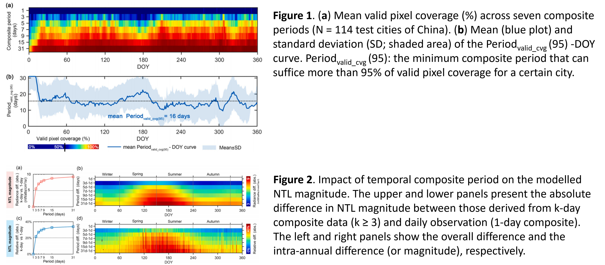

## Understanding the Urban-Climate-Environment nexus with geospatial data, model, and ML/AI techniques. 

### Topic 1: Nighttime Light Remote Sensing

1. **Impact of temporal compositing on nighttime light data and its applications**   
  We utilized over 180,000 daily NTL tiles from NASA’s Black Marble VIIRS product (VNP46A2, 2012–2020), covering 230 cities from China and the United States, to delve    into the influence of temporal compositing on valid pixel coverage and spatiotemporal pattern of NTL data and the performance of three representative types of NTL-based applications. [[PDF](https://github.com/qmzheng09work/qmzheng09work.github.io/raw/master/_publications/NTL_composite_Zheng_2023.pdf)][[Online](https://www.sciencedirect.com/science/article/pii/S0034425722001304?via%3Dihub)].

   

### Topic 2: Understanding global urbanization for sustainable urban developing   

1. 
